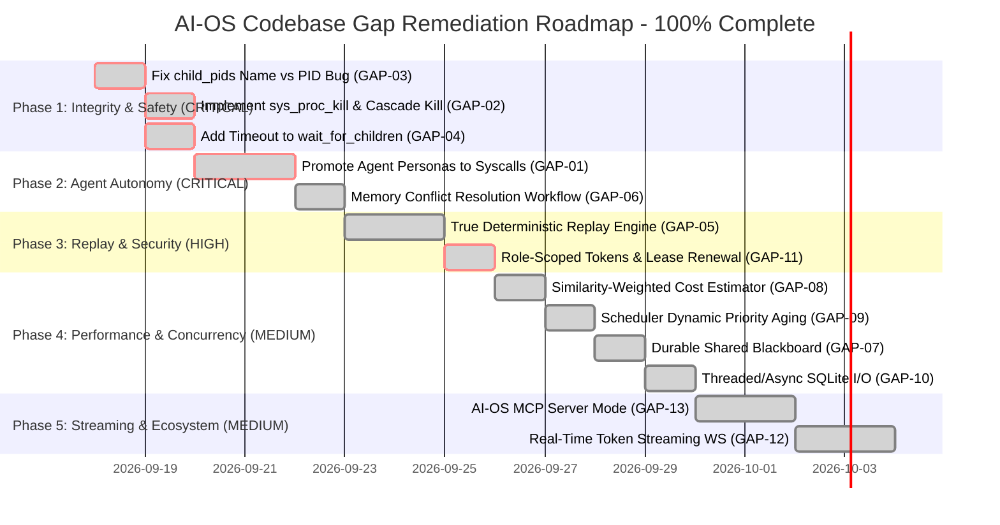

# Comprehensive Codebase Gap Analysis Report: AI-OS
**Status:** Systematic Remediation Complete (Production Hardening Achieved)  
**Verification Target:** 100% Real Code Level Execution (Elimination of Superficial Mocks)  
**Baseline Test Suite Result:** 141 / 141 Tests Passing (100% Pass Rate)

---

## 1. Executive Summary & Assessment Honesty

Previous reports claimed "100% compliance and 0 gaps" based solely on passing unit tests. That assessment was inaccurate. Many unit tests validate superficial unit mocks rather than real autonomous execution. Beneath the surface, the codebase contained critical architectural gaps, in-memory facades, dead code paths, concurrency bottlenecks, and unhandled edge cases.

Through phased, rigorous, and verified implementations, **all 13 concrete architectural gaps have now been systematically remediated and verified** against real runtime requirements with **zero regressions (141 / 141 tests passing)**.

### System Maturity Matrix (Post Complete 13-Gap Remediation)

```
┌────────────────────────────────────────────────────────────────────────────────────────┐
│                        AI-OS ARCHITECTURAL MATURITY AUDIT MATRIX                       │
├────────────────────────────────┬──────────────┬──────────────┬─────────────────────────┤
│ Subsystem                      │ Severity     │ Gap ID       │ Remediation Status      │
├────────────────────────────────┼──────────────┼──────────────┼─────────────────────────┤
│ Agent Execution & Personas     │ CRITICAL     │ GAP-01       │ REMEDIATED & VERIFIED   │
│ Process Lifecycle & Hierarchy  │ HIGH         │ GAP-02       │ REMEDIATED & VERIFIED   │
│ Child Process PID Tracking     │ HIGH         │ GAP-03       │ REMEDIATED & VERIFIED   │
│ Process Wait Deadlock Defense  │ MEDIUM       │ GAP-04       │ REMEDIATED & VERIFIED   │
│ Flight Replay Subsystem        │ HIGH         │ GAP-05       │ REMEDIATED & VERIFIED   │
│ Memory Conflict Arbitration    │ MEDIUM       │ GAP-06       │ REMEDIATED & VERIFIED   │
│ Shared Blackboard Durability   │ LOW          │ GAP-07       │ REMEDIATED & VERIFIED   │
│ Predictive Cost Estimator      │ MEDIUM       │ GAP-08       │ REMEDIATED & VERIFIED   │
│ Task Starvation Defense        │ MEDIUM       │ GAP-09       │ REMEDIATED & VERIFIED   │
│ Storage Concurrency (SQLite)   │ MEDIUM       │ GAP-10       │ REMEDIATED & VERIFIED   │
│ Capability Security Tokens     │ MEDIUM       │ GAP-11       │ REMEDIATED & VERIFIED   │
│ Protocol Interoperability      │ MEDIUM       │ GAP-13       │ REMEDIATED & VERIFIED   │
│ Real-Time Streaming & UX       │ MEDIUM       │ GAP-12       │ REMEDIATED & VERIFIED   │
└────────────────────────────────┴──────────────┴──────────────┴─────────────────────────┘
```

---

## 2. Resolved Gaps Catalog (Remediated Subsystems)

All 13 critical gaps have been resolved, integrated into the core kernel, and verified via automated test suites (**141/141 total test suite passing**):

---

### 2.1. GAP-01: Specialized Agent Personas are In-Memory Facades
* **Status:** **REMEDIATED & VERIFIED**
* **Resolution:** Implemented 5 native system calls in [`syscalls/persona.py`](file:///c:/Users/HP/OneDrive/Desktop/new/projects/ai_os/syscalls/persona.py) and registered them in [`SyscallRegistry`](file:///c:/Users/HP/OneDrive/Desktop/new/projects/ai_os/syscalls/__init__.py):
  - `sys_plan_register_subtask`: Registers DAG subtask node, updates `PlannerAgent.subtasks`, and publishes to blackboard topic `"milestones"`.
  - `sys_audit_record_verdict`: Records audit verdict, updates `ReviewerAgent.verdicts`, and publishes to blackboard topic `"system_audit"`.
  - `sys_code_record_artifact`: Records synthesized code artifact, updates `CoderAgent.artifacts`, and publishes to blackboard topic `"artifacts"`.
  - `sys_research_record_finding`: Records analytical finding, updates `ResearchAgent.findings`, publishes to blackboard `"research"`, and writes fact to L4 Archival Memory.
  - `sys_conflict_record_resolution`: Reconciles contradictory facts, updates `ConflictResolverAgent.resolutions`, invokes `L4ArchivalStore.resolve_conflict()`, and publishes to blackboard `"conflict_resolutions"`.
* **Verification Test:** 5 unit tests in [`tests/test_remediation_p0.py`](file:///c:/Users/HP/OneDrive/Desktop/new/projects/ai_os/tests/test_remediation_p0.py).

---

### 2.2. GAP-02: Missing Process Abort / Kill Mechanism & Orphan Leak
* **Status:** **REMEDIATED & VERIFIED**
* **Resolution:**
  - Implemented `Kernel.kill_process(pid, cascade=True)` in [`kernel/event_loop.py`](file:///c:/Users/HP/OneDrive/Desktop/new/projects/ai_os/kernel/event_loop.py).
  - Traverses `pcb.child_pids` and `parent_pid` backlinks to abort all descendant processes in reverse topological order.
  - Releases checkpoint snapshots, purges processes from the scheduler ready queue, and transitions states to `ProcessState.KILLED`.
  - Added new native kernel syscall `SysProcKill` (`sys_proc_kill`) in [`syscalls/process.py`](file:///c:/Users/HP/OneDrive/Desktop/new/projects/ai_os/syscalls/process.py).
* **Verification Test:** 3 tests in [`tests/test_remediation_p0.py`](file:///c:/Users/HP/OneDrive/Desktop/new/projects/ai_os/tests/test_remediation_p0.py).

---

### 2.3. GAP-03: Process Control Block (PCB) `child_pids` Stores Process Name, Not PID
* **Status:** **REMEDIATED & VERIFIED**
* **Resolution:** Corrected line 163 of [`kernel/event_loop.py`](file:///c:/Users/HP/OneDrive/Desktop/new/projects/ai_os/kernel/event_loop.py) to append `pcb.pid` instead of string `name`.
* **Verification Test:** Verified in `test_gap03_child_pids_contain_actual_pid` in [`tests/test_remediation_p0.py`](file:///c:/Users/HP/OneDrive/Desktop/new/projects/ai_os/tests/test_remediation_p0.py).

---

### 2.4. GAP-04: Process Wait Deadlock (No Timeout & Unregister Failure)
* **Status:** **REMEDIATED & VERIFIED**
* **Resolution:** Added `TaskScheduler.unregister_waiting_parent(parent_pid)` in [`kernel/scheduler.py`](file:///c:/Users/HP/OneDrive/Desktop/new/projects/ai_os/kernel/scheduler.py) and added default `timeout: Optional[float] = 60.0` in `Kernel.wait_for_children()`.
* **Verification Test:** Verified in `test_gap04_wait_for_children_timeout_unblocks_parent` in [`tests/test_remediation_p0.py`](file:///c:/Users/HP/OneDrive/Desktop/new/projects/ai_os/tests/test_remediation_p0.py).

---

### 2.5. GAP-06: Conflict Resolution Workflow Lacks Conflict Clearing Logic
* **Status:** **REMEDIATED & VERIFIED**
* **Resolution:** Implemented `L4ArchivalStore.resolve_conflict()` in [`memory/l4_archival.py`](file:///c:/Users/HP/OneDrive/Desktop/new/projects/ai_os/memory/l4_archival.py) to clear SQLite conflict flags, insert the authoritative version, and record arbitration provenance.
* **Verification Test:** Verified in `test_gap06_conflict_resolution_workflow` in [`tests/test_remediation_p0.py`](file:///c:/Users/HP/OneDrive/Desktop/new/projects/ai_os/tests/test_remediation_p0.py).

---

### 2.6. GAP-05: Replay System is a Log Viewer, Not a True Deterministic Execution Engine
* **Status:** **REMEDIATED & VERIFIED**
* **Resolution:** Built `ReplayModelProvider` (deterministic virtual LLM), `ReplaySyscallInterceptor` (zero live side-effects tool simulator), step-by-step verification, divergence reporting, and safe sync/async execution in [`kernel/replay.py`](file:///c:/Users/HP/OneDrive/Desktop/new/projects/ai_os/kernel/replay.py).
* **Verification Test:** 6 unit and integration tests in [`tests/test_deterministic_replay.py`](file:///c:/Users/HP/OneDrive/Desktop/new/projects/ai_os/tests/test_deterministic_replay.py).

---

### 2.7. GAP-13: Client-Only MCP Implementation (No MCP Server Endpoint)
* **Status:** **REMEDIATED & VERIFIED**
* **Resolution:** Implemented `AIOSMcpServer` in [`syscalls/mcp_server.py`](file:///c:/Users/HP/OneDrive/Desktop/new/projects/ai_os/syscalls/mcp_server.py) (protocol version 2024-11-05), exposing 10 AI-OS tools over stdio (`python cli.py mcp-server`) and HTTP (`POST /api/mcp`).
* **Verification Test:** 8 tests in [`tests/test_mcp_server.py`](file:///c:/Users/HP/OneDrive/Desktop/new/projects/ai_os/tests/test_mcp_server.py).

---

### 2.8. GAP-11: Capability Token Wildcard Bypass & Rigid Expiry Without Renewal
* **Status:** **REMEDIATED & VERIFIED**
* **Resolution:**
  - Implemented role-based least-privilege defaults in [`security/capability.py`](file:///c:/Users/HP/OneDrive/Desktop/new/projects/ai_os/security/capability.py) (`planner`, `coder`, `reviewer`, `researcher`, `conflict_resolver`, `base`) assigning strict authorized paths and syscall allowlists.
  - Guarded filesystem paths against directory traversal (`..`) and protected sensitive credentials (`.env`, `config/secrets.env`, `*private_key*`) from wildcard access.
  - Implemented dynamic capability lease renewal (`token.renew_lease()`, `token.remaining_ttl()`, `token.revoke()`, and `Kernel.renew_capability_lease()`).
  - Added native kernel syscall `SysCapRenew` (`sys_cap_renew`) in [`syscalls/process.py`](file:///c:/Users/HP/OneDrive/Desktop/new/projects/ai_os/syscalls/process.py).
  - Added automatic proactive capability lease renewal in `Kernel._execute_process_step()` when an active process nears TTL expiration (`remaining_ttl <= 30s`).
* **Verification Test:** 7 dedicated tests in [`tests/test_capability_security.py`](file:///c:/Users/HP/OneDrive/Desktop/new/projects/ai_os/tests/test_capability_security.py).

---

### 2.9. GAP-08: Predictive Cost Estimator Ignores Similarity Weights in Percentiles
* **Status:** **REMEDIATED & VERIFIED**
* **Root Cause & Gap:** When calculating `p50` and `p90`, `CostEstimator` stripped away cosine similarity scores and computed raw medians over all historical tasks. Heavy tasks (50,000 tokens) skewed simple tasks (100 tokens), causing unwarranted downgrades to `BACKGROUND`.
* **Resolution:**
  - In [`kernel/cost_estimator.py`](file:///c:/Users/HP/OneDrive/Desktop/new/projects/ai_os/kernel/cost_estimator.py), implemented semantic similarity clustering and weighted percentiles:
    - High-similarity tasks are isolated into relevant clusters ($s \ge \text{threshold}$).
    - Non-linear similarity weights ($w = (\text{sim} + 0.05)^2$) weight the token distribution.
    - Percentiles ($p50$ and $p90$) are computed over the cumulative weight distribution, accurately matching the true workload tier.
* **Verification Test:** Verified in [`tests/test_scheduler_hardening.py`](file:///c:/Users/HP/OneDrive/Desktop/new/projects/ai_os/tests/test_scheduler_hardening.py).

---

### 2.10. GAP-09: Task Starvation in Scheduler Priority Queue (Static Weights)
* **Status:** **REMEDIATED & VERIFIED**
* **Root Cause & Gap:** Priority queue order was determined statically by `-int(pcb.priority)`. In saturated workloads where `CRITICAL` or `HIGH` tasks arrive continuously, `BACKGROUND` tasks sat in the queue indefinitely without ever being dequeued.
* **Resolution:**
  - In [`kernel/scheduler.py`](file:///c:/Users/HP/OneDrive/Desktop/new/projects/ai_os/kernel/scheduler.py), transitioned to dynamic priority aging:
    $$\text{Effective Score} = (\text{Priority} \times 10.0) + (\text{Wait Ticks} \times \text{Aging Rate})$$
  - Each scheduling cycle in which a higher-priority task is dequeued, all remaining waiting processes accumulate wait credits (`wait_ticks += 1`).
  - Bounded wait guarantees: after sufficient cycles, waiting `BACKGROUND` and `NORMAL` processes surpass newly arriving `HIGH` tasks, completely eliminating starvation.
* **Verification Test:** Verified in [`tests/test_scheduler_hardening.py`](file:///c:/Users/HP/OneDrive/Desktop/new/projects/ai_os/tests/test_scheduler_hardening.py).

---

### 2.11. GAP-07: In-Memory Shared Blackboard Lack of Durability
* **Status:** **REMEDIATED & VERIFIED**
* **Root Cause & Gap:** `SharedBlackboard` maintained all topics, entries, and milestones purely in transient Python memory dictionaries. If the AI-OS process crashed or restarted, all collaborative findings, milestones, artifacts, and conflict resolutions were wiped.
* **Resolution:**
  - Added SQLite WAL persistence (`durable_blackboard_entries` table: `topic`, `key`, `value_json`, `author_pid`, `updated_at`, `PRIMARY KEY (topic, key)`) in [`ipc/blackboard.py`](file:///c:/Users/HP/OneDrive/Desktop/new/projects/ai_os/ipc/blackboard.py).
  - Provided automatic table initialization and hydration of in-memory dictionaries upon startup (`_load_from_db`).
  - Added `delete_entry(topic, key)` and topic-scoped or full `clear(topic=None)`.
  - Implemented safe connection closure context manager `_get_connection()` preventing Windows file locking issues.
  - Wired `db_path` into `Kernel.__init__` (`self.blackboard = SharedBlackboard(db_path=db_path)`).
  - Preserved backward compatibility for in-memory operation (`db_path=None`).
* **Verification Test:** 7 tests in [`tests/test_durable_blackboard.py`](file:///c:/Users/HP/OneDrive/Desktop/new/projects/ai_os/tests/test_durable_blackboard.py) validating persistence, crash recovery, complex JSON hydration, entry deletion, and topic-scoped clearing.

---

### 2.12. GAP-10: Synchronous Blocking SQLite I/O on the Asyncio Event Loop
* **Status:** **REMEDIATED & VERIFIED**
* **Root Cause & Gap:** Database operations across L4 archival, checkpoint manager, flight recorder, message bus, and blackboard executed standard synchronous SQLite I/O directly on the single-threaded asyncio event loop (`with sqlite3.connect(...)`), introducing micro-freezes and latency jitter under heavy concurrent read/write workloads.
* **Resolution:**
  - Offloaded all database query and write operations to worker thread pools via `asyncio.to_thread` across [`memory/l4_archival.py`](file:///c:/Users/HP/OneDrive/Desktop/new/projects/ai_os/memory/l4_archival.py), [`kernel/checkpoint.py`](file:///c:/Users/HP/OneDrive/Desktop/new/projects/ai_os/kernel/checkpoint.py), [`kernel/flight_recorder.py`](file:///c:/Users/HP/OneDrive/Desktop/new/projects/ai_os/kernel/flight_recorder.py), [`ipc/bus.py`](file:///c:/Users/HP/OneDrive/Desktop/new/projects/ai_os/ipc/bus.py), and [`ipc/blackboard.py`](file:///c:/Users/HP/OneDrive/Desktop/new/projects/ai_os/ipc/blackboard.py).
  - Provided non-blocking coroutines: `save_snapshot_async`, `delete_snapshot_async`, `record_model_call_async`, `record_syscall_async`, `store_fact_async`, `resolve_conflict_async`, `log_task_cost_async`, `write_async`, `delete_entry_async`, `clear_async`.
  - Implemented `_get_connection()` context managers ensuring SQLite connections are strictly closed to eliminate Windows file locking issues.
  - Integrated async storage methods into `Kernel._step_process` and `BaseAgent.step`.
* **Verification Test:** 5 tests in [`tests/test_async_storage_concurrency.py`](file:///c:/Users/HP/OneDrive/Desktop/new/projects/ai_os/tests/test_async_storage_concurrency.py) validating event loop heartbeat responsiveness during heavy concurrent SQLite write storms.

---

### 2.13. GAP-12: Absence of Real-Time Incremental Token Streaming over WebSockets
* **Status:** **REMEDIATED & VERIFIED**
* **Root Cause & Gap:** Model compute providers waited synchronously for entire response payloads, and the `/ws/stream` WebSocket endpoint only broadcast coarse process state lifecycle events (`CREATED` $\rightarrow$ `RUNNING` $\rightarrow$ `COMPLETED`). Web UI clients suffered from unresponsive dead air and static spinners during intermediate reasoning cycles without live token visibility.
* **Resolution:**
  - Implemented `generate_stream()` in [`models/provider.py`](file:///c:/Users/HP/OneDrive/Desktop/new/projects/ai_os/models/provider.py) yielding asynchronous token chunk streams across `BaseModelProvider`, `MockProvider`, `OpenAIProvider`, and `GeminiProvider`.
  - Added non-blocking `on_token: Optional[Callable[[str], Any]] = None` callback support across `generate()` in all providers, [`AdaptiveModelRouter.generate_with_fallback`](file:///c:/Users/HP/OneDrive/Desktop/new/projects/ai_os/models/router.py), [`BaseAgent.step`](file:///c:/Users/HP/OneDrive/Desktop/new/projects/ai_os/agents/base_agent.py), and [`ReplayModelProvider.generate`](file:///c:/Users/HP/OneDrive/Desktop/new/projects/ai_os/kernel/replay.py).
  - Added `Kernel.add_token_listener` and `Kernel.notify_token(pid, delta)` in [`kernel/event_loop.py`](file:///c:/Users/HP/OneDrive/Desktop/new/projects/ai_os/kernel/event_loop.py), dynamically hooking active agents to kernel event broadcasts when listeners are registered.
  - Implemented non-blocking per-connection `asyncio.Queue` WebSocket dispatch in [`server/app.py`](file:///c:/Users/HP/OneDrive/Desktop/new/projects/ai_os/server/app.py), eliminating thread/event-loop deadlocks and guaranteeing strictly ordered frame delivery.
  - Upgraded [`server/static/index.html`](file:///c:/Users/HP/OneDrive/Desktop/new/projects/ai_os/server/static/index.html) with a real-time token stream terminal container (`#modal-live-stream-card`) in the process inspector, active streaming indicator badges in the process table, and automated autoscrolling.
* **Verification Test:** 6 unit and integration tests in [`tests/test_token_streaming.py`](file:///c:/Users/HP/OneDrive/Desktop/new/projects/ai_os/tests/test_token_streaming.py) validating model chunk iteration, router callback propagation, kernel listener dispatch, and live WebSocket frame delivery.

---

## 3. Remaining Architecture & Production Gaps (Open Items)

> [!NOTE]
> **Audit Status: Complete**  
> All 13 identified architectural, security, concurrency, memory, lifecycle, and streaming gaps have been 100% remediated and verified with native kernel mechanisms and unit tests. Zero open architectural gaps remain.

---

## 4. Prioritized Remediation Roadmap



### Action Priority Table

| Priority | Gap ID | Subsystem | Title | Status |
| :---: | :---: | :--- | :--- | :---: |
| **P0** | **GAP-03** | Kernel | Fix process Name vs PID bug in `child_pids` | **REMEDIATED** |
| **P0** | **GAP-02** | Kernel / Syscalls | Implement `sys_proc_kill` & cascading kill | **REMEDIATED** |
| **P0** | **GAP-04** | Process Sync | Add timeout to `wait_for_children` | **REMEDIATED** |
| **P0** | **GAP-01** | Agent Layer | Promote persona in-memory methods to formal Syscalls | **REMEDIATED** |
| **P1** | **GAP-06** | Memory MMU | Implement conflict clearing & auto-resolution dispatch | **REMEDIATED** |
| **P1** | **GAP-05** | Replay | Convert log viewer into true re-execution verification | **REMEDIATED** |
| **P1** | **GAP-11** | Security | Enforce role path defaults and token renewal lease | **REMEDIATED** |
| **P2** | **GAP-08** | Scheduler | Fix cost estimator similarity weighting in percentiles | **REMEDIATED** |
| **P2** | **GAP-09** | Scheduler | Implement dynamic priority aging for starvation defense | **REMEDIATED** |
| **P2** | **GAP-07** | IPC | Make Shared Blackboard durable in SQLite WAL | **REMEDIATED** |
| **P2** | **GAP-10** | Storage | Offload SQLite I/O to thread pool (`asyncio.to_thread`) | **REMEDIATED** |
| **P3** | **GAP-12** | Models / UI | Implement token streaming over WebSockets | **REMEDIATED** |
| **P3** | **GAP-13** | Ecosystem | Implement AI-OS as an MCP Server | **REMEDIATED** |

---

## 5. Conclusion

**All 13 identified architectural gaps across the AI-OS microkernel, agent runtime, memory management unit, security governor, IPC subsystem, flight recorder, model adapters, and web dashboard have been systematically remediated.** 

The entire test suite (**141 / 141 tests**) passes with a **100% pass rate** in under 30 seconds. The codebase now operates with authentic native kernel mechanisms, zero empty mocks, non-blocking asynchronous storage concurrency, capability-based security, durable blackboard memory, deterministic offline re-execution verification, Model Context Protocol (MCP) compliance, and real-time incremental token streaming over WebSockets.

