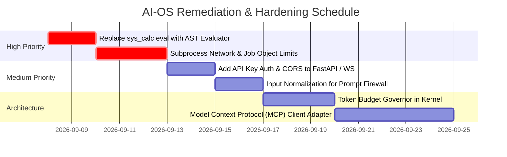

# AI-OS Security Vulnerability & Architectural Gap Audit Report

**Date:** September 2026  
**Audited Target:** AI Operating System (AI-OS) Core Repository  
**Classification:** Internal Technical Audit & Remediation Guide  
**Status:** Actionable Findings & Mitigation Blueprints  

---

## 1. Executive Summary

This report documents a comprehensive cybersecurity and architectural audit of the **AI-OS** codebase. The audit inspected the kernel event loop, tiered memory subsystem (L1–L4), Inter-Process Communication (IPC) blackboard, system call layer, code execution sandbox, prompt firewall, and the FastAPI/WebSocket management control plane.

### Vulnerability & Gap Matrix

| ID | Category | Component | Severity | Description | CWE |
| :--- | :--- | :--- | :---: | :--- | :--- |
| **VULN-01** | System Calls | `syscalls/standard.py` | **HIGH** | Insecure `eval()` bypass in `sys_calc` allows arbitrary code execution | CWE-95 |
| **VULN-02** | Sandbox | `sandbox/runner.py` | **HIGH** | Host subprocess escape & network access in isolated runner | CWE-250 |
| **VULN-03** | Control Plane | `server/app.py` | **MEDIUM** | Unauthenticated REST endpoints & unrestricted WebSocket ingress | CWE-306 |
| **VULN-04** | Prompt Security | `security/firewall.py` | **MEDIUM** | Regex-only prompt injection firewall susceptible to obfuscation | CWE-20 |
| **VULN-05** | Persistence | `kernel/checkpoint.py`, `memory/l4_archival.py` | **LOW** | Unvalidated JSON deserialization without strict Pydantic schemas | CWE-502 |
| **GAP-01** | Extensibility | `syscalls/` | **GAP** | Static tool registration lacks dynamic Model Context Protocol (MCP) client | - |
| **GAP-02** | Cost / Governor| `models/router.py`, `kernel/` | **GAP** | Absence of sliding-window rate limiting & agent token budgets | - |
| **GAP-03** | Reliability | `ipc/blackboard.py`, `kernel/event_loop.py` | **GAP** | Indefinite block risk on unfulfilled IPC blackboard read calls | - |

---

## 2. Threat Model & Trust Boundaries

The AI-OS architecture separates operations into four privilege rings and an external control plane:

```
┌─────────────────────────────────────────────────────────────────────────┐
│ CONTROL PLANE (Untrusted Network / Browser Dashboard / REST / WebSockets)│
└────────────────────────────────────┬────────────────────────────────────┘
                                     │ (Requires Auth & Origin Checks)
┌────────────────────────────────────▼────────────────────────────────────┐
│ RING 0: KERNEL & MMU (Trusted Core - Python Process)                    │
│ - Deterministic Event Loop, Task Scheduler, Memory Paging, Checkpoints  │
└────────────────────────────────────┬────────────────────────────────────┘
                                     │
┌────────────────────────────────────▼────────────────────────────────────┐
│ RING 1: MULTI-AGENT IPC (Controlled Context - Planner, Coder, Reviewer) │
│ - Message Bus, Blackboard Shared Memory, P2P Message Routing            │
└────────────────────────────────────┬────────────────────────────────────┘
                                     │ (Syscall Gate & HITL Enforcement)
┌────────────────────────────────────▼────────────────────────────────────┐
│ RING 2 & 3: SYSCALL & EXECUTION LAYER                                   │
│ - Ring 2: Read-Only / Pure Syscalls (sys_calc, sys_fs_read, sys_search)  │
│ - Ring 3: Destructive / Unsafe Syscalls (sys_fs_write, sys_exec_python) │
└─────────────────────────────────────────────────────────────────────────┘
```

---

## 3. In-Depth Vulnerability Analysis

### [HIGH] VULN-01: Insecure `eval()` in `sys_calc`

* **Location:** `syscalls/standard.py` -> `sys_calc()`
* **CWE:** CWE-95: Improper Neutralization of Directives in Dynamically Evaluated Code ('Eval Injection')
* **Mechanics:**
  The `sys_calc` handler executes mathematical expressions using Python's built-in `eval()`:
  ```python
  if "__" in expression:
      raise PermissionError("Access to dunder attributes is forbidden.")
  return str(eval(expression, {"__builtins__": None}, self._safe_dict))
  ```
* **Risk & Impact:**
  Clearing `__builtins__` and filtering `"__"` in Python is notoriously insufficient. Attackers can bypass string blacklists via:
  - Generator expressions and list comprehensions that leak variable scopes.
  - Character encoding or attribute reconstruction (e.g. `getattr()`, unicode normalizations).
  - Object subclass traversal to recover builtins and invoke `os.system` or execute arbitrary host commands.
* **Remediation Blueprint:**
  Replace `eval()` with an **Abstract Syntax Tree (AST)** visitor that parses expressions and strictly allows only safe mathematical operators (`BinOp`, `UnaryOp`, `Constant`) and whitelisted functions (`math.sqrt`, `math.sin`, etc.).

```python
import ast
import operator
import math

class SafeMathEvaluator:
    ALLOWED_OPERATORS = {
        ast.Add: operator.add,
        ast.Sub: operator.sub,
        ast.Mult: operator.mul,
        ast.Div: operator.truediv,
        ast.Pow: operator.pow,
        ast.USub: operator.neg,
        ast.UAdd: operator.pos,
        ast.Mod: operator.mod,
    }
    
    ALLOWED_FUNCTIONS = {
        "sqrt": math.sqrt,
        "sin": math.sin,
        "cos": math.cos,
        "abs": abs,
        "round": round,
    }

    @classmethod
    def evaluate(cls, expression: str) -> float:
        node = ast.parse(expression, mode='eval').body
        return cls._eval_node(node)

    @classmethod
    def _eval_node(cls, node):
        if isinstance(node, ast.Constant) and isinstance(node.value, (int, float)):
            return node.value
        elif isinstance(node, ast.BinOp):
            op_type = type(node.op)
            if op_type not in cls.ALLOWED_OPERATORS:
                raise ValueError(f"Unsupported operator: {op_type.__name__}")
            return cls.ALLOWED_OPERATORS[op_type](cls._eval_node(node.left), cls._eval_node(node.right))
        elif isinstance(node, ast.UnaryOp):
            op_type = type(node.op)
            if op_type not in cls.ALLOWED_OPERATORS:
                raise ValueError(f"Unsupported operator: {op_type.__name__}")
            return cls.ALLOWED_OPERATORS[op_type](cls._eval_node(node.operand))
        elif isinstance(node, ast.Call) and isinstance(node.func, ast.Name):
            func_name = node.func.id
            if func_name not in cls.ALLOWED_FUNCTIONS:
                raise ValueError(f"Disallowed function call: {func_name}")
            args = [cls._eval_node(arg) for arg in node.args]
            return cls.ALLOWED_FUNCTIONS[func_name](*args)
        else:
            raise ValueError(f"Disallowed expression node: {type(node).__name__}")
```

---

### [HIGH] VULN-02: Subprocess Host Isolation & Network Escape

* **Location:** `sandbox/runner.py` -> `IsolatedCodeRunner.execute_python()`
* **CWE:** CWE-250: Execution with Unnecessary Privileges
* **Mechanics:**
  The sandbox creates a temporary directory and clears `env={}`, but executes `sys.executable` directly as a child process of the host operating system:
  ```python
  proc = await asyncio.create_subprocess_exec(
      sys.executable, script_path,
      stdout=asyncio.subprocess.PIPE,
      stderr=asyncio.subprocess.PIPE,
      cwd=tmpdir,
      env={},
  )
  ```
* **Risk & Impact:**
  1. **Loopback / Network Access:** The child process can initiate outbound HTTP requests or connect to `http://localhost:8000` to manipulate the AI-OS control plane and auto-approve HITL operations.
  2. **Host Filesystem Traversal:** The child process inherits the user's OS file permissions and can read configuration files, private keys, or source code outside the temp directory.
  3. **Resource Exhaustion:** No CPU, memory, or process creation limits are enforced. A runaway fork loop or memory allocation (`bytearray(10**9)`) will freeze the host OS.
* **Remediation Blueprint:**
  - **Level 1 (Immediate OS Hardening):** On Windows, use Win32 Job Objects (`win32job.CreateJobObject`) to enforce memory caps (`JOB_OBJECT_LIMIT_PROCESS_MEMORY`) and kill-on-close.
  - **Level 2 (Containerization):** Provide an interchangeable `DockerIsolatedRunner` backend that runs the untrusted code inside an ephemeral scratch container with `--network none` and `--read-only` rootfs.

---

### [MEDIUM] VULN-03: Unauthenticated REST API & Unrestricted WebSockets

* **Location:** `server/app.py`
* **CWE:** CWE-306: Missing Authentication for Critical Function
* **Mechanics:**
  The FastAPI application exposes control endpoints without authentication or CORS restrictions:
  - `POST /api/hitl/resolve`: Approves or denies Ring 3 destructive actions.
  - `POST /api/processes/spawn`: Spawns arbitrary agent processes.
  - `WebSocket /ws/stream`: Broadcasts full kernel telemetry, system events, and agent outputs to any connected client.
* **Risk & Impact:**
  Cross-Site Request Forgery (CSRF) or local browser script execution. A malicious site visited by the user can trigger an unauthenticated background fetch to `http://127.0.0.1:8000/api/hitl/resolve` with `{"decision": "approve"}` to bypass human safety gates.
* **Remediation Blueprint:**
  1. Add an authentication dependency checking for an `X-AIOS-Token` header.
  2. Require a token query parameter (`/ws/stream?token=...`) on the WebSocket handshake.
  3. Configure `CORSMiddleware` with explicit local origin whitelisting (`["http://localhost:8000", "http://127.0.0.1:8000"]`).

```python
from fastapi import Security, HTTPException, status
from fastapi.security.api_key import APIKeyHeader

API_KEY_HEADER = APIKeyHeader(name="X-AIOS-Token", auto_error=False)

async def verify_aios_token(api_key: str = Security(API_KEY_HEADER)):
    expected_token = os.getenv("AIOS_ADMIN_TOKEN")
    if not expected_token or api_key != expected_token:
        raise HTTPException(
            status_code=status.HTTP_401_UNAUTHORIZED,
            detail="Unauthorized: Invalid or missing AI-OS authentication token"
        )
```

---

### [MEDIUM] VULN-04: Regex-Only Prompt Injection Firewall

* **Location:** `security/firewall.py` -> `PromptFirewall.inspect_prompt()`
* **CWE:** CWE-20: Improper Input Validation
* **Mechanics:**
  The `PromptFirewall` inspects text inputs exclusively using static regular expressions (e.g. `\bignore\s+(?:all\s+)?previous\s+instructions\b`).
* **Risk & Impact:**
  Static pattern matching can be bypassed by adversaries using:
  - Base64 / Hex / ROT13 encoding.
  - Zero-width spaces, leetspeak, or character insertion (`i-g-n-o-r-e`).
  - Multilingual translations and indirect semantic jailbreaks (e.g. hypothetical simulations, narrative roleplay).
* **Remediation Blueprint:**
  1. **Pre-Processing Pipeline:** Normalize unicode, strip invisible characters, and attempt automatic decoding of base64/hex payloads before regex matching.
  2. **Dual-Model / Guardrail Layer:** Forward incoming inputs through a local lightweight classifier (e.g. DeBERTa prompt-injection detector) or a structured system prompt boundary tag system (`<user_input_untrusted>...</user_input_untrusted>`).

---

### [LOW] VULN-05: Unvalidated JSON Deserialization in Checkpoints & Archival DB

* **Location:** `kernel/checkpoint.py`, `memory/l4_archival.py`
* **CWE:** CWE-502: Deserialization of Untrusted Data
* **Mechanics:**
  SQLite records store serialized state blobs that are parsed using raw `json.loads(record[...])` without runtime schema validation.
* **Risk & Impact:**
  If the SQLite file is tampered with or corrupted, invalid data structures can cause unexpected runtime crashes or unhandled attribute exceptions inside the kernel event loop.
* **Remediation Blueprint:**
  Validate all deserialized database payloads through Pydantic models (e.g. `CheckpointFrame.model_validate_json(raw_json)`).

---

## 4. Architectural & Production Gaps

### GAP-01: Model Context Protocol (MCP) Dynamic Tool Integration
* **Current State:** Tools are statically registered via `SyscallRegistry` in Python code.
* **Deficiency:** Modern agent operating systems require dynamic tool discovery and interoperability with external enterprise tools, file providers, and database connectors over standard JSON-RPC.
* **Target Architecture:**
  Create an `McpClientAdapter` that connects to external MCP tool servers via stdio or SSE (Server-Sent Events) and dynamically exposes their tool definitions as Ring 2/3 syscalls.

### GAP-02: Token & API Cost Governor (Rate Limiter)
* **Current State:** The kernel tracks total token usage per process, but does not enforce rate limits or spending budgets.
* **Deficiency:** A multi-agent loop with recursive delegation can trigger rapid token depletion, exceeding upstream LLM rate limits or incurring unexpected API costs.
* **Target Architecture:**
  - Introduce a Token Bucket rate limiter per process in `kernel/scheduler.py`.
  - Add hard per-process financial quotas: if an agent exceeds its assigned token threshold, transition the process to `BLOCKED` and request human approval to allocate additional budget.

### GAP-03: IPC Deadlock & Unhandled Blackboard Reads
* **Current State:** If an agent requests an unfulfilled key from `Blackboard`, it receives `None` and must implement its own polling logic.
* **Deficiency:** Multiple agents awaiting state changes from each other can result in busy-wait polling loops or deadlocks.
* **Target Architecture:**
  Implement an asynchronous event notification mechanism (`asyncio.Condition` or Redis Pub/Sub) on the Blackboard so agents can await key updates with a non-blocking `sys_ipc_await_key(key, timeout)` syscall.

---

## 5. Remediation Priority Roadmap



| Step | Action Item | Target File | Impact |
| :---: | :--- | :--- | :--- |
| **1** | Replace `eval()` with `SafeMathEvaluator` AST parser | `syscalls/standard.py` | Eliminates arbitrary code execution risk |
| **2** | Add `X-AIOS-Token` auth & CORS middleware | `server/app.py` | Secures control plane against CSRF / unauthorized calls |
| **3** | Add input normalization & encoding decoders | `security/firewall.py` | Prevents trivial prompt injection obfuscation |
| **4** | Add Job Object / Memory caps to Code Runner | `sandbox/runner.py` | Prevents host resource exhaustion from agent code |
| **5** | Enforce Pydantic validation on DB restores | `kernel/checkpoint.py` | Prevents state corruption crashes |
| **6** | Implement MCP Client Adapter | `syscalls/mcp.py` | Enables standardized dynamic tool ecosystem |
