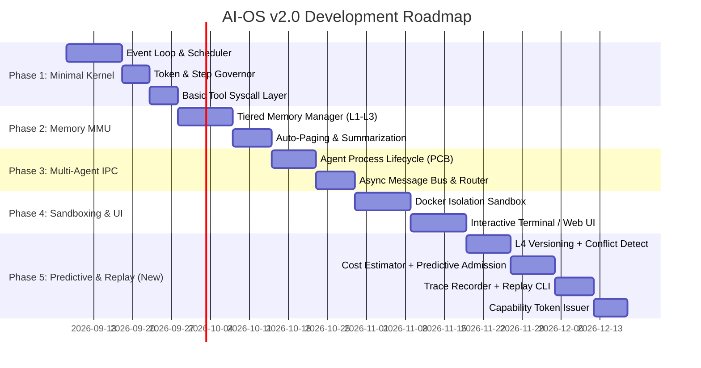

# AI Operating System (AI-OS) – Architectural Blueprint v2.0
### (Revised: Predictive Scheduling, Conflict-Aware Memory, Deterministic Replay, Capability Security)

---

## 1. Overview & Core Philosophy

Modern AI systems are evolving beyond standalone chatbots and ad-hoc agent scripts into **AI Operating Systems (AI-OS)**.

An AI-OS is a software platform that manages, coordinates, and isolates AI models, autonomous agents, persistent memory hierarchies, and external tools to reliably execute multi-step workflows.

### The Core Thesis

> **The intelligence of an AI-OS stems from the entire system architecture — the kernel, scheduling, memory virtualization, and safety controls — not merely the underlying model.**

### What's New in v2.0

The original design solved five real problems (context overflow, runaway costs, no process model, unsafe execution, crash amnesia) largely by adapting known patterns (MemGPT-style paging, sandboxed execution, priority queues). v2.0 keeps that foundation intact but adds four capabilities that close gaps existing agent frameworks still don't address:

| Gap in v1.0 | v2.0 Addition |
|---|---|
| Governor stops runaway cost *after* it happens | **Predictive Cost Estimator** — blocks/downgrades *before* execution |
| Agents can silently overwrite each other's facts in memory | **Conflict-Aware Memory** — versioned writes, contradiction detection |
| Failed agent runs cannot be reproduced for debugging | **Deterministic Replay / Flight Recorder** |
| Static Ring 0–3 permissions are coarse (all-or-nothing per ring) | **Scoped Capability Tokens** — per-task, per-path, time-limited grants |

```
Traditional AI:
User ──► LLM ──► Text Response

Agent Frameworks (LangChain / CrewAI):
User ──► Hardcoded Orchestration Script ──► Model Prompts ──► Direct Tool Execution

AI-OS v1.0:
User ──► OS Shell/API ──► Kernel (Scheduler + Memory MMU + Sandbox) ──► IPC ──► Isolated Tools & Models

AI-OS v2.0:
User ──► OS Shell/API ──► Kernel (PREDICTIVE Scheduler + CONFLICT-AWARE MMU +
          Capability-Scoped Sandbox + REPLAY Recorder) ──► IPC ──► Isolated Tools & Models
```

---

## 2. Evolution of AI Architectures (Unchanged)

```
┌─────────────────┐  ┌─────────────────┐  ┌─────────────────┐  ┌───────────────────────┐  ┌───────────────────────┐
│ Stage 1: LLMs   │─►│ Stage 2: RAG    │─►│ Stage 3: Agents │─►│ Stage 4: Multi-Agent  │─►│ Stage 5: AI-OS        │
│ Prompt ──► Text │  │ Dynamic Context │  │ Planning & Tools│  │ Collaborative Teams   │  │ Kernel & Resource Mgt │
└─────────────────┘  └─────────────────┘  └─────────────────┘  └───────────────────────┘  └───────────────────────┘
```

---

## 3. Computer Science Analogy (Updated)

| OS Concept | Traditional OS | AI-OS v1.0 | AI-OS v2.0 (New) |
| :--- | :--- | :--- | :--- |
| **Compute Core (CPU)** | Silicon Cores | LLM Inference Engines | *(unchanged)* |
| **Working Memory (RAM)** | DRAM & Cache | Active Prompt Context | *(unchanged)* |
| **Secondary Storage** | NVMe / SSD | Vector DBs, SQL Stores | + **versioned fact store with conflict flags** |
| **Process / Thread** | `fork()` / `exec()` | Autonomous Agents | + **capability-scoped spawn (task-bound permissions)** |
| **Memory Manager (MMU)** | Paging, TLB, Swap | Context Paging & Eviction | + **conflict detection on write-back** |
| **Scheduler** | CFS, Round-Robin | Token-budgeted Priority Queue | + **cost-predictive admission control** |
| **Syscalls** | POSIX (`read`,`write`) | MCP Tool Calling | *(unchanged)* |
| **Protection Rings** | Ring 0 vs Ring 3 | Deterministic Kernel vs Agent | + **short-lived capability tokens (not just static rings)** |
| **IPC** | Pipes, Sockets | JSON Event Bus / Blackboard | + **`MEMORY_CONFLICT` event type** |
| **Debugging** | Core dumps, `strace` | *(none — v1.0 gap)* | + **deterministic replay / flight recorder** |
| **Security & Sandbox** | cgroups, SELinux | Docker/Wasm, ACLs, HITL | + **capability tokens scoped to path + TTL** |

---

## 4. High-Level AI-OS Architecture (v2.0)

```
┌────────────────────────────────────────────────────────────────────────┐
│                        1. INTERFACE LAYER                              │
│         CLI Dashboard  │  REST / WebSocket API  │  Web UI              │
│                    + `cli.py replay --trace-id X`                      │
└───────────────────────────────────┬────────────────────────────────────┘
                                    │
┌───────────────────────────────────▼────────────────────────────────────┐
│                    2. AI-OS KERNEL (CONTROL PLANE)                     │
│  ┌───────────────────────┐  ┌───────────────────┐  ┌────────────────┐  │
│  │ Event Loop & Dispatch │  │ PREDICTIVE        │  │ Token Governor │  │
│  │                       │  │ Scheduler          │  │ + Cost Cap     │  │
│  │                       │  │ (Cost Estimator)   │  │                │  │
│  └───────────────────────┘  └───────────────────┘  └────────────────┘  │
│  ┌───────────────────────┐  ┌───────────────────┐  ┌────────────────┐  │
│  │ Context MMU (Paging + │  │ IPC Message Bus   │  │ Capability     │  │
│  │ Conflict Detection)   │  │ (+ Conflict Event) │  │ Token Issuer   │  │
│  └───────────────────────┘  └───────────────────┘  └────────────────┘  │
│  ┌────────────────────────────────────────────────────────────────┐    │
│  │        Trace Recorder (Flight Recorder for Replay)             │    │
│  └────────────────────────────────────────────────────────────────┘    │
└───────────────────┬───────────────────────────────┬────────────────────┘
                    │                               │
┌───────────────────▼─────────────┐   ┌─────────────▼────────────────────┐
│         3. AGENT LAYER          │   │         4. MEMORY LAYER          │
│   Planner Agent (PID 101)       │   │  L1: Active Prompt Buffer        │
│   Research Agent (PID 102)      │   │  L2: Conversation History Cache  │
│   Coding Agent (PID 103)        │   │  L3: Semantic Vector DB          │
│   Validation Agent (PID 104)    │   │  L4: Versioned Archival Store    │
│   Conflict Resolver (on demand) │   │      (fact history + conflicts)  │
└───────────────────┬─────────────┘   └──────────────────────────────────┘
                    │
┌───────────────────▼────────────────────────────────────────────────────┐
│         5. SYSCALL & TOOL EXECUTION LAYER (CAPABILITY-SCOPED SANDBOX)  │
│   MCP Server Adapters │ Docker Pods (scoped token) │ Read-Only APIs    │
└────────────────────────────────────────────────────────────────────────┘
```

---

## 5. Core Kernel Subsystems

### 5.1. Deterministic Control Plane vs. Non-Deterministic Agent Plane
*(Unchanged from v1.0 — this principle stays foundational.)*
- **Kernel:** 100% deterministic, standard code, no LLM involvement in scheduling/security decisions.
- **Agents:** Non-deterministic, invoked strictly as compute workers.

### 5.2. Predictive Task Scheduler & Cost Estimator *(New)*

**Problem this solves:** existing governors only cap cost *reactively* (kill after budget exceeded). This adds *proactive* admission control.

**Design:**
1. Every completed task's `(role, instruction_embedding, tokens_consumed, wall_time)` is logged to L4 on completion.
2. On `sys_proc_spawn`, the `CostEstimator`:
   - Embeds the new task instruction.
   - Runs a similarity search against L4 historical task records (same role).
   - Produces a predicted token/cost range (e.g., p50 / p90 estimate).
3. Admission decision:
   - Predicted cost within budget → `READY` queue as normal.
   - Predicted cost exceeds budget → auto-downgrade to `BACKGROUND` priority, or route to HITL for pre-approval, **before** any tokens are spent.
   - No historical data available → run with a conservative default budget and tag the record as a "cold start" for future estimation.

**Interface addition:**
```python
class CostEstimator:
    def estimate(self, role: str, instruction: str) -> CostEstimate:
        """Returns predicted token range + confidence from L4 history."""

class CostEstimate(BaseModel):
    predicted_tokens_p50: int
    predicted_tokens_p90: int
    confidence: float
    sample_size: int
```

### 5.3. Existing Governor Controls *(Retained)*
- Token quotas, step/recursion limits, priority tiers (`HIGH` / `NORMAL` / `BACKGROUND`) remain as the reactive backstop behind the new predictive layer.

---

## 6. Tiered Memory Hierarchy — Conflict-Aware MMU *(Revised)*

```
┌─────────────────────────────────────────────────────────────┐  Fastest / Most Expensive
│ L1: Active Context (Working Memory)                         │
└──────────────────────────────┬──────────────────────────────┘
                               │ Paged / Evicted
┌──────────────────────────────▼──────────────────────────────┐
│ L2: Session Buffer (Recent Dialogue)                        │
└──────────────────────────────┬──────────────────────────────┘
                               │ Summarized / Vectorized
┌──────────────────────────────▼──────────────────────────────┐
│ L3: Semantic Recall (Vector DB)                              │
└──────────────────────────────┬──────────────────────────────┘
                               │ Structured Long-Term Storage
┌──────────────────────────────▼──────────────────────────────┐
│ L4: VERSIONED Archival Knowledge Base (New)                  │
│ - Every fact write tagged: agent_pid, timestamp, confidence  │
│ - Contradiction check on write                               │
└─────────────────────────────────────────────────────────────┘
```

**New behavior on `sys_mem_write`:**
1. Compute semantic similarity between the incoming fact and existing L4 entries on the same topic/key.
2. If similarity is high but content conflicts (e.g., different values for the same entity/attribute):
   - Do **not** silently overwrite.
   - Emit a `MEMORY_CONFLICT` event on the IPC bus with both versions + provenance (which agent, when, confidence).
   - Either route to a lightweight **Conflict Resolver** agent role, or surface via HITL if confidence is low on both sides.
3. Otherwise, write proceeds normally and is versioned (append, not overwrite) so history is always auditable.

**Schema addition (L4 record):**
```json
{
  "fact_id": "fact-9021",
  "key": "customer_42.subscription_tier",
  "value": "enterprise",
  "written_by_pid": "agent-proc-103",
  "confidence": 0.87,
  "version": 3,
  "superseded_fact_id": "fact-8990",
  "conflict_flag": false,
  "timestamp": "2026-09-08T10:00:00Z"
}
```

---

## 7. Agent Process Lifecycle & PCB *(Revised)*

Process states unchanged (`CREATED → READY → RUNNING → BLOCKED/TERMINATED`). PCB schema extended with capability scope and cost-estimate fields:

```json
{
  "pid": "agent-proc-4092",
  "parent_pid": "agent-proc-1001",
  "agent_role": "code_auditor",
  "state": "RUNNING",
  "priority": 2,
  "token_limits": {
    "max_tokens": 100000,
    "tokens_consumed": 18450,
    "predicted_tokens_p90": 42000
  },
  "step_limits": {
    "max_steps": 20,
    "current_step": 4
  },
  "allocated_tools": ["git_diff", "run_linter", "read_file"],
  "capability_token": {
    "scope_paths": ["/tmp/task_4092/**"],
    "allowed_syscalls": ["sys_fs_read", "sys_fs_write"],
    "issued_at": "2026-09-08T12:00:00Z",
    "expires_at": "2026-09-08T12:01:30Z"
  },
  "trace_id": "trace-7749-user-query",
  "created_at": "2026-09-08T12:00:00Z",
  "last_heartbeat": "2026-09-08T12:02:15Z"
}
```

---

## 8. Syscall Abstraction & Tool Execution *(Unchanged categories, new enforcement layer)*

Categories (Memory / Process / I/O syscalls) stay the same. What changes is **who authorizes each call** — see Section 9.

---

## 9. Security — Capability-Scoped Rings *(Revised)*

The static Ring 0–3 model is kept as the conceptual backbone (it's a useful mental map for engineers), but enforcement now happens through **short-lived, scoped capability tokens** issued at spawn time rather than a coarse binary allow/deny per ring.

```
┌─────────────────────────────────────────────────────────────┐
│ RING 0: Kernel Space (Trusted Core, no tokens needed)        │
├─────────────────────────────────────────────────────────────┤
│ RING 1: Safe Tools — token grants read-only scope            │
├─────────────────────────────────────────────────────────────┤
│ RING 2: Mutating Tools — token grants path + TTL scoped      │
│         write access (e.g. /tmp/task_4092/** for 90s)        │
├─────────────────────────────────────────────────────────────┤
│ RING 3: Destructive — token requires HITL co-signature       │
│         AND is scoped + time-boxed even after approval       │
└─────────────────────────────────────────────────────────────┘
```

**Why this matters:** a Ring 2 grant today means "this agent can write files, anywhere, indefinitely for the life of the process." A capability token means "this agent can write only inside its own task's scratch directory, and only for the next 90 seconds" — meaningfully reducing blast radius without adding operator friction.

**Token issuance interface:**
```python
class CapabilityToken(BaseModel):
    scope_paths: list[str]        # glob patterns
    allowed_syscalls: list[str]
    issued_at: datetime
    expires_at: datetime
    requires_hitl: bool
```

All other v1.0 safety primitives are retained unchanged: isolated Docker/Wasm execution, HITL gates for Ring 3, prompt injection firewall with input normalization.

---

## 10. Deterministic Replay / Flight Recorder *(New Subsystem)*

**Problem this solves:** agent behavior is non-deterministic, so production failures can't be reproduced for debugging — the single most requested missing capability in agent frameworks today.

**Design:** extends the existing `CheckpointManager` rather than adding new infrastructure.

1. Every model call is recorded: `(trace_id, step_seq, prompt, response, temperature, seed, tool_calls)`.
2. Every syscall is recorded: `(trace_id, step_seq, syscall_name, input, output, latency)`.
3. Records are appended to the same SQLite WAL store used for checkpoints, keyed by `trace_id`.
4. A new CLI command replays a trace by feeding recorded tool/model outputs back into the kernel in sequence, without re-calling the live LLM or live tools — reconstructing the exact failure deterministically.

```powershell
python cli.py replay --trace-id trace-7749-user-query
```

**Schema:**
```json
{
  "trace_id": "trace-7749-user-query",
  "step_seq": 4,
  "type": "model_call",
  "prompt_hash": "sha256:...",
  "response": "...",
  "temperature": 0.0,
  "seed": 42,
  "timestamp": "2026-09-08T12:02:00Z"
}
```

---

## 11. Inter-Process Communication (IPC) Protocol *(Extended)*

Existing envelope format unchanged. New message type added:

```json
{
  "message_id": "msg-88311",
  "trace_id": "trace-7749-user-query",
  "sender": "kernel-mmu",
  "recipient": "broadcast",
  "msg_type": "MEMORY_CONFLICT",
  "timestamp": "2026-09-08T12:05:00Z",
  "payload": {
    "key": "customer_42.subscription_tier",
    "existing_value": "pro",
    "existing_written_by": "pid-101",
    "incoming_value": "enterprise",
    "incoming_written_by": "pid-103",
    "resolution": "PENDING"
  }
}
```

---

## 12. Concrete Technology Stack *(Extended)*

| Layer | Component | Recommended Technology | Rationale |
| :--- | :--- | :--- | :--- |
| Control Plane | Runtime & Event Loop | Python 3.11+ (asyncio) / Rust | Async dispatch, AI ecosystem fit |
| API & IPC Bus | Transport | FastAPI + Redis Streams | Low-latency pub/sub |
| Relational Storage | System State & PCBs | SQLite / PostgreSQL | ACID audit trails |
| Memory / Vector DB | L3 Recall | Qdrant / pgvector | Cosine similarity search |
| **Cost History Store** | **L4 task-cost index (New)** | **Same PostgreSQL, indexed on role+embedding** | **Feeds CostEstimator** |
| **Trace Store** | **Replay records (New)** | **Same SQLite WAL as checkpoints** | **Reuses existing durable log** |
| Tool Execution | Sandbox Runtime | Docker Engine SDK / Wasm | Isolation |
| Tool Protocol | Standardization | Model Context Protocol (MCP) | Open tool standard |
| User Interface | Terminal & Web UI | Textual + React/Next.js | Real-time visualization |

---

## 13. Phased Engineering Roadmap *(Revised — Phase 5 Added)*



### Phase 5: Predictive & Replay (New)
- Extend L4 schema with versioning + `conflict_flag`; implement contradiction detection on `sys_mem_write`.
- Build `CostEstimator` using historical L4 task-cost index; wire into scheduler admission control.
- Extend `CheckpointManager` into a full trace recorder; add `cli.py replay --trace-id`.
- Replace static ring-only enforcement with `CapabilityToken` issuance at `sys_proc_spawn`, checked on every syscall dispatch.

---

## 14. Security Architecture, Threat Model & Gap Audit *(Retained + One Addition)*

All v1.0 vulnerability remediations (VULN-01 through VULN-05) remain in force unchanged — the AST-based `sys_calc`, Docker sandbox network isolation, REST auth tokens, prompt firewall normalization, and Pydantic-validated checkpoint loads.

**New item for the audit table:**

| ID | Component | Severity | Issue | Remediation Plan |
| :--- | :--- | :---: | :--- | :--- |
| VULN-06 | `kernel/scheduler.py` (new) | MEDIUM | Static ring grants persist for full process lifetime, widening blast radius if an agent is compromised mid-task | Issue `CapabilityToken` with path scope + short TTL at spawn; re-validate on every syscall dispatch, not just at ring boundary |

---

## 15. Summary of Changes from v1.0 → v2.0

1. **Scheduler:** reactive-only → predictive + reactive (Cost Estimator added before admission).
2. **Memory:** silent overwrite → versioned writes with contradiction detection and `MEMORY_CONFLICT` events.
3. **Debugging:** none → deterministic replay via extended checkpoint/trace recorder.
4. **Security:** static per-ring allow/deny → short-lived, path-scoped capability tokens issued per task.
5. **Roadmap:** added Phase 5 to implement all of the above on top of the existing Phase 1–4 foundation — no rework of earlier phases required.